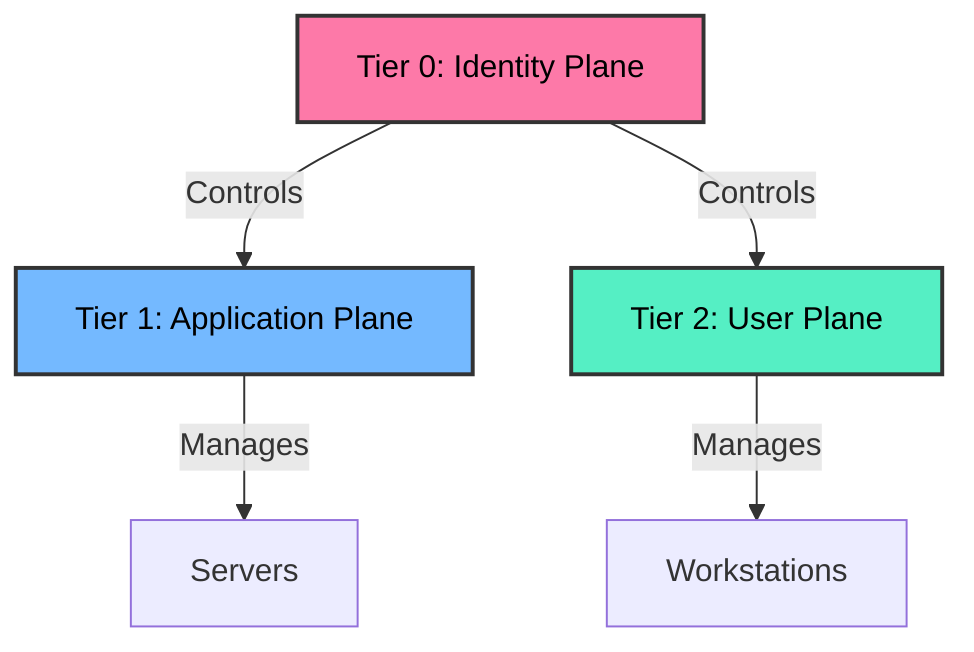

# AD-DEPLOYER v2.1

**Automated, Hardened, and Tiered Active Directory Infrastructure Deployment**

[](https://opensource.org/licenses/MIT)
[](https://www.ansible.com/)
[](https://www.microsoft.com/windows-server)
[](https://www.vagrantup.com/)
[](https://cyber.gouv.fr/publications/recommandations-pour-ladministration-securisee-des-si-reposant-sur-ad)

---

## Overview

**AD-DEPLOYER** is an automation engine designed to provision enterprise-grade Active Directory environments.

Built on **Ansible** and **Bash**, it strictly implements the **ANSSI Tiering Model** (PA-099) and enforces rigorous security hardening by default, making it suitable for:
*   Red Team / Blue Team Labs
*   Infrastructure Validation
*   Educational Environments

---

## Key Features

| Feature | Description |
| :--- | :--- |
| **ANSSI Tiering** | Automatic OU structure for **Tier 0** (Identity), **Tier 1** (Servers), and **Tier 2** (Workstations). |
| **Hardening** | Pre-configured policies: `SMB Signing`, `LDAP Signing`, `No NTLMv1`, `LSASS Protection`. |
| **Interactive Wizard** | CLI menu guides through configuration steps. |
| **Infrastructure as Code** | Full **Vagrant** support for 1-click lab instantiation. |
| **Audit & Logging** | Comprehensive logging to `logs/` for post-deployment reviews. |
| **Modular Design** | Granular control via Ansible tags. |

---

## Architecture (Tiering Model)

This tool automatically segments your AD environment to prevent privilege escalation attacks.



---

## Prerequisites

*   **Linux / WSL** Environment
*   **Ansible** (2.14+)
*   **Python 3** (`pip3 install pywinrm requests-ntlm`)
*   *(Optional)* **Vagrant** + **VirtualBox/VMware**

---

## Getting Started

### Option 1: Vagrant (Automated)
This will create a VM, configure network/WinRM, and deploy AD automatically.
```bash
vagrant up
```

### Option 2: Manual Control
Deploy to an existing Windows Server (e.g., bare metal, ESXi, Hyper-V) accessible via IP.

1.  **Clone Repository**
    ```bash
    git clone https://github.com/0xsir1s/AD-DEPLOYER.git
    cd AD-DEPLOYER/ad-deployer
    ```

2.  **Run Wizard**
    ```bash
    ./deploy-ad.sh
    ```

3.  **Command Line Mode**
    ```bash
    ./deploy-ad.sh -t 192.168.1.50 -d cyber.corp -p 'Admin123!' -s 'SafeMode123!' -H anssi
    ```

---

## Configuration Options

| Flag | Argument | Description |
| :--- | :--- | :--- |
| `-t` | `--target` | IP Address of the target Windows Server. |
| `-d` | `--domain` | FQDN of the new domain (e.g., `lab.local`). |
| `-p` | `--password` | WinRM / Administrator password. |
| `-H` | `--hardening` | Security Level: `minimal`, `standard`, `anssi`, `paranoid`. |
| `-v` | `--verbose` | Enable extensive logging for debugging. |

---

## Project Structure

```text
AD-DEPLOYER/
├── Vagrantfile             # IaC definition
├── README.md               # Documentation
└── ad-deployer/
    ├── deploy-ad.sh        # Main orchestration script
    ├── .gitattributes      # Line-ending enforcer
    ├── logs/               # Log storage
    └── ansible/
        ├── inventory/      # Dynamic inventory
        └── playbooks/
            ├── 01-bootstrap.yml    # Prerequisites
            ├── 02-forest.yml       # Domain Creation
            ├── 03-structure.yml    # OUs & Modeling
            ├── 04-access.yml       # RBAC Groups
            ├── 05-identities.yml   # User Objects
            ├── 06-hardening.yml    # Security Policies
            └── 07-policies.yml     # GPO Enforcement
```

---

## Author

**0xsir1s** (DISIZ)
*   *Cybersecurity Student & Infrastructure Enthusiast*
*   [GitHub](https://github.com/DISIZ)

---

> **Note:** This tool is intended for educational and testing purposes.
